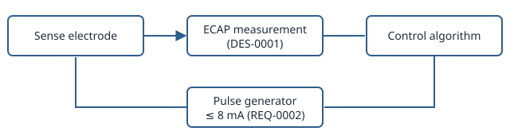
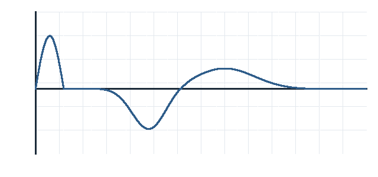

# System Requirements Specification

This document is authored prose interleaved with live query blocks
(High-Level Design §4.3a) — it stores only the queries below, never a copy
of the entities they resolve. Editing [[REQ-0001]] anywhere in the
repository updates what this document renders next time it's generated,
with nothing to keep in sync by hand.

## Scope

This specification covers the closed-loop stimulation control requirements
for the NeuroPulse system, decomposed from the user needs in [[USR-0001]]
and [[USR-0002]]. The control loop they constrain is shown in
[[#control-loop]], and the evoked response it regulates on in
[[#ecap-response]].



```caption
kind: figure
id: control-loop
text: Closed-loop amplitude control. The sense electrode's evoked response
  ([[DES-0001]]) sets the next pulse's amplitude, within the ceiling of
  [[REQ-0002]].
```



```caption
kind: diagram
id: ecap-response
text: A typical evoked compound action potential, after the stimulus
  artefact. The control loop holds the *N1* trough's depth in its target
  band.
```

## Requirements

All approved requirements, in author-assigned order:

```query
from: Requirement
where:
  field: status
  operator: equals
  value: approved
order_by: order
```

## Amplitude Ceiling — Subsystem Detail

The system-level ceiling is [[REQ-0002#title]], allocated to the subsystem
level as an independent hardware safeguard. [[#amplitude-limits]] lists the
limits at each level.

| Level | Limit | Enforced by |
| --- | --- | --- |
| System | 8 mA under any single fault | [[REQ-0002]] |
| Subsystem | Hard current limit in the ASIC | [[REQ-0003]] |

```caption
kind: table
id: amplitude-limits
text: Stimulation amplitude limits by level.
```

The subsystem requirement in full:

![[REQ-0003]]

## Traceability Note

Full traceability to design elements, risk controls, and verification
evidence is generated separately as coverage reports (Requirements Spec
§7a) rather than duplicated in this document's own query blocks.
